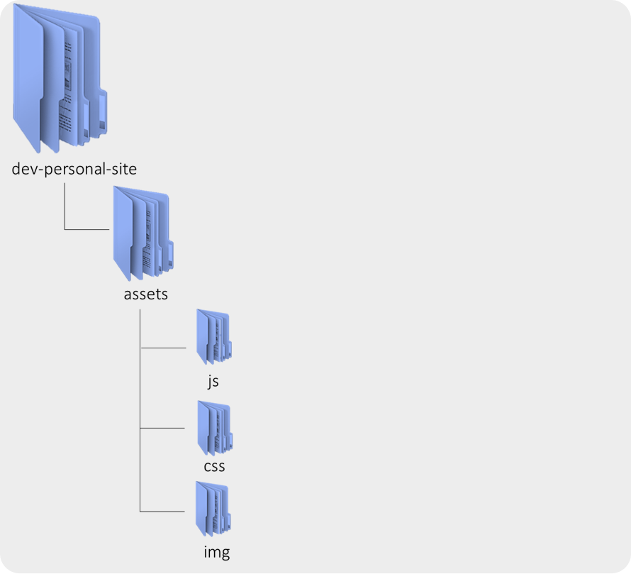

# Web tutorial
_@codewithtshikororoda_ | 2022

### Project requirements
Alright, now it’s time to make your own _personal website_. Design a personal webpage about yourself. The project should be subject to the following Specification:
+ Your website must contain at least four different _`pages`_, and it should be possible to get from any page on your website to any other page by following one or more _`hyperlinks`_.
+ Your website must include at least one _`list (ordered or unordered)`_, at least one _`table`_, and at least one _`image`_.
+ You should also have some content placed within _`paragraph`_.
+ Your website must have at least one stylesheet file. The stylesheet(s) must use at least five different _`CSS properties`_, and at least five different types of _`CSS selectors`_. You must use the _`#id selector`_ at least once, and the _`.class selector`_ at least once.
+ •	All symbols should be implemented using `HTML entities`.

***

### Let’s start with our development
Let's start by creating a _website directory on `c driver`_ for storing all our personal website files. We will be working on _`Git Bash terminal`_ to create our _personal website directory_. Now, open your _Git bash terminal_, then click inside _terminal_ after it has open, and then _type_ the following command: _`cd c:/`_ followed by an _`Enter`_.

+ _`Change directory to move to c drive`._
```
$ cd c:/
```
  >_From here on out, to execute (i.e., run) a command means to type it into a git bash terminal and then hit Enter. Commands are “case-sensitive,” so be sure not to type in uppercase when you mean lowercase or vice versa._

+ _`Create a new directory called workspace on c drive`_. _Now, execute command below:_
```
$ mkdir workspace
```
_To move yourself into (i.e., open) that directory. Our prompt should now resemble the below. Now, execute command below:_
```
$ cd workspace
```

+ _`Create a new directory called dev-personal-site`. Now, execute command below:_
``` 
$ mkdir dev-personal-site
```
_To move yourself into (i.e., open) that directory. Our prompt should now resemble the command below. Now, execute command below:_
      $ cd dev-personal-site

:clap: We have successfully created _root directory_ of our _personal website_. <br />
Below is the list of _command we have used_:

| Command | Description                  |
| ------- | ---------------------------- |
| _cd_    | _Change directory._          |
| _mkdir_ | _To create a new directory._ |

### GitHub
GitHub is a _code hosting platform for version control and collaboration_. It lets us and others work together on projects from anywhere. At first, we will look at GitHub essentials: _repositories, branches, commits, and pull requests_. Since we have already created our development environment directory called _dev-personal-site directory_, we’ll make it a _repository_ and learn GitHub's _pull request_ workflow which is a popular way to create and review code.

### Repository
#### Create a file called _`README.md`_.
We can create files from _git bash terminal_ in two ways. The first way is to use _**touch command**_ and the other way is to use _**echo command**_. If you want to write any specific data in the file, then use _**echo command**_. If you are not bothered about the data in the file but just want to create a file, then you can use _**touch command**_. <br />
_Now, execute the command below_:

```
$ echo "# Personal website root directory " > README.md
$ ls

```

Below is the list of command we have used:

| Command | Description                       |                 |
| ------- | ----------------------------------| --------------- |
| _ls_	  | To know what is on the directory  |                 |
| _cat_	  | To create a file with content	    | cat > filename  |
| _touch_ |	To create a file without content  | touch filename  |
| _fsutil_|	To create a file of specific size |                 |

#### Make _`dev-personal-site`_ directory a Git Repository

````
$ git init

````

The _`git init command`_ will Initialize _dev-personal-site directory_ to an empty _Git repository in C:/workspace/dev-personal-site/.git/._

### Project directory Structure


Now, let’s create the _subdirectory_ folder using _Git bash terminal_. For creating subfolder called _`assets`_. assets directory is a subdirectory of _`dev-personal-site`_ directory. Inside _assets_ directory we will create subdirectory of assets called _css, js and img_ as shown above. <br />
_Now, execute the command below_:

```
$ mkdir assets
$ cd assets
$ mkdir css js img
$ ls
$ cd ../

```

_Note_
|
<br />
&nbsp;&nbsp;&nbsp;&nbsp;&nbsp;&nbsp;&nbsp;&nbsp;
|
_`cd ../` - to go to the previous directory_

Use _`touch command`_ to create html files

Our personal website must contain at least four different _html_ pages. Our four different pages or models will be:

| Models	  | Html files                                   |
| --------- | ---------------------------------------------|
| Home	    | _index.html - This will be our landing page_ |
| About     | _about.html_                                 |
| Skills	  | _skills.html_                                |
| Portfolio | _portfolio.html_                             |   
| Contact   | _contact.html_                               |  

Now, execute the command below:

```
$ touch index.html about.html skills.html portfolio.html contact.html

```

#### Create version file
To begin tracking a _file version_, we use _`git add command`_. A version of a version is created whenever _git commit command_ has been performed. <br />
This will be our first commit on the _`main branch`_. We will create other branches to work on and _`merge`_ them on _`main branch`_ whenever we are happy with the results. In this personal website’s projects, we will make branch for each _html_ files for the purpose of learning. <br />

Let's now begin tracking _index.html, about.html, skills.html, portfolio.html and contact.html_.

_Now, execute the command below_:
````
$ git add .
$ git commit -m " First commit: create an empty version of all html files "

````

#### Creating a _new_ branch
Now, before we do actual coding, let’s create a new branch for each html page. As we said earlier, the whole purpose of this is to learn. We have already said we will create branch for each page and merge them with _`main branch`_ whenever we are happy with the results. It’s a good practise to commit file and merge branches when we have meet project requirements at each stage. So, lets create a new branch called _`home, about, skill, home, portfolio, contact`_. _To do this, let’s execute the following command_:
```
$ git branch home
$ git branch about
$ git branch skill
$ git branch portfolio
$ git branch contact

```

#### Basic branching and merging
Now, you have switch to home branch. Let’s go through a simple example of branching and merging with a workflow that you might use in the real world based on our personal website project. Let’s follow these steps:

1. Do some work on a website main branch: = > _`‘You have done html5 document skeleton?’`_
2.	Create a branch for a new personal website you’re working on: => _`‘You have created home branch’`_
3.	Do some work in that new created branch: => _`‘This what we are going to do now’`_

#### Switching branches
To switch to homepage branch, you execute the following command:
```
$ git checkout home

```

### Home - Landing page
#### Document Appropriate Skelton
First, we need to open our HTML editor _(Notepad++)_. When you open index.html, it will be clean white file which is to write your source code. If you are a new beginner on html, switch to [`simple task`](#) before we perform the actual coding.

In [HTML document structure](https://github.com/tshikororoda/html-css-js.git) repository, we can re-implement _hds_ source code, there's a folder called [_hds_](https://github.com/tshikororoda/html-css-js.git), there's html file named _hds.index.html_. Open the this html file, then copy and paste everything on your _index.html_ on your project and save the changes. Before we _commit_ this changes on our repository, we must validate our markup language. We use [ w3 Mark-up validation service](https://validator.w3.org/). Validate _index.html_ on your project, `fix all the bugs`, when everything is ok, create a new version of your file with the following massage, _“I have added document structure for landing page”_.

The first thing we will do is to _design prototype layout_. We do have apps specialized for prototype which professional developer use to design full – scale layout of the websites. But for this tutorial, the prototype screens are design using _Microsoft PowerPoint 2016_.


