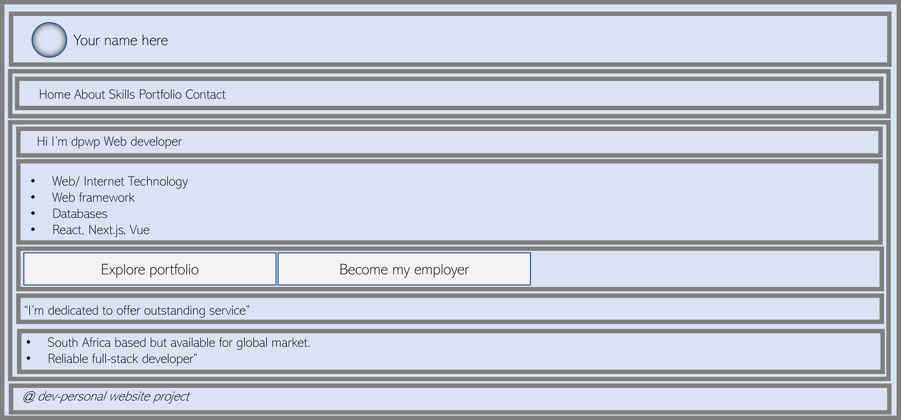
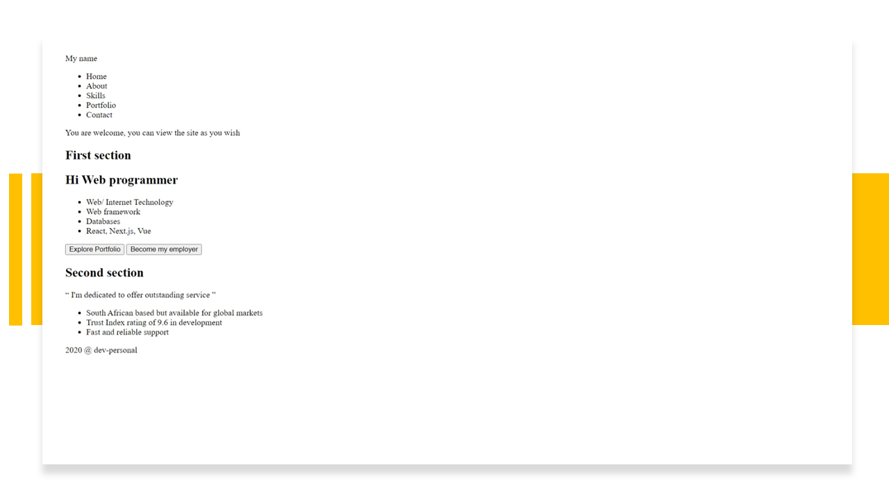

# Web Tutorial

#### &#47;&#8227; Table of contents

+ 01 ][ Project requirements ](#project-requirements)
+ 02 ][ Download and Install dev tools ](#devtools)
+ 03 ][ Let’s start with development ](#lets-start)
+ 04 ][ Git - control version ](#control-version)            
+ 05 ][ Repository ](#repository)
+ 06 ][ Project directory structure ](#project-directory-structure)
+ 07 ][ Home - Landing page ](#home-landing-page)
+ 08 ][ Moving project directory to a local web server ](#webserver)
+ 09 ][ Split source code on *index.html* ](#split-source-code)
+ 10 ][ Load module mark-up to entry point](#load-module-dynamically)

<a name="project-requirements"></a>
#### &#47;&#8227; Project requirements

&#182; *Alright,* now it’s time to make our own personal website. Design a personal webpage about ourselves. The project should be subject to the following specification.

+ Our website must contain at least four different pages, and it should be possible to get from any page on your website to any other page by following one or more hyperlinks.
+ Our website must include at least one list *(ordered or unordered)*, at least one table, and at least one image.
+ Our should also have some content placed within paragraph.
+ Your website must have at least one stylesheet file. The stylesheets must use at least five different CSS properties, and at least five different types of CSS selectors. You must use the id selector at least once, and the class selector at least once.
+ All symbols should be implemented using HTML entities.

#### &#47;&#8227; What we need

&#182; *In this tutorial*, I assume we have some experience on web development software, and preferably have at least a basic understanding of HTML4.0/5 and vanilla JavaScript.

<a name="devtools"></a>
#### &#47;&#8227; Download and install dev tools

+ `Text editor` for writing code. [*Notepad++*](https://notepad-plus-plus.org/downloads/) is a good option for Windows, [ *Text Wrangler* ](https://www.barebones.com/products/textwrangler/) is a good choice for Macs, And [ *Emacs* ](https://www.gnu.org/software/emacs/) is a good choice for Linux.

+ `Web browser` *Chrome, Firefox, Internet explorer, Microsoft Edge, Safari, Opera etc*. If we choose to use Firefox: we need to install the Firebug plugin to gain access to a full suite of development tools but there is nothing presented in this tutorial that does not work with *Firefox, IE10 or Safari*. I believe the developer tools in Chrome are now superior to those offered by other browsers, therefore if you are starting from scratch, [ *I strongly recommend Chrome.* ](https://www.google.com/chrome/)

+ `Web Server` *This will only be required later in this tutorial*, and I will explaining how to install and use the *Mongoose web server*. We may choose to use any other web server we like [ *Apache HTTP Server.* ](https://github.com/tshikororoda/web-servers), but the instructions here will only be provided for [ *Mongoose web server* ](#webserver).

+ `Version control` [Git](https://git-scm.com/download/win)

*` Last modified: 2023-07-08 time: 19:02PM `*

<a name="lets-start"></a>
### &#47;&#8227; Let’s start with development
&#182; Let's start by creating a website directory on *c drive* for storing all our personal website files. This is where all our website projects will live. We will be working on Git Bash terminal to create our personal website directory. *Now*, open *Git bash terminal*, after it has open, then *type* the command below followed by an *Enter*.

*&#8227; Change directory into c drive.*

``` sh

# Execute command

cd c:/

```

*&#8227; Create a new directory named workspace on c drive.*

``` sh

# Execute command

mkdir workspace
cd workspace # To move into workspace directory.

```

*&#8227; Create a new sub-directory named dev-personal.*

``` sh

# Execute command

mkdir dev-personal
cd dev-personal # To move into dev-personal directory.

```

*:clap: We have successfully created root directory of our personal website*.

Below is the list of *command we have used*:

| Command | Description                  |
 -------- | -----------------------------
  _cd_    | _Change directory._
  _mkdir_ | _To create a new directory._

*` Last modified: 2023-07-08 time: 19:02PM `*

<a name="control-version"></a>
### &#47;&#8227; Git - control version

&#182; GitHub is a code hosting platform for version control and collaboration. It enable a team of developers to work together on projects from anywhere. Firstly, we will look at git essentials: *`repositories`, `branches`, `commits`, and `pull requests`*. In this section, we will make our development environment directory *`git repository`* and learn GitHub's *`pull request workflow`* which is a popular way to *create and review code*.

<a name="repository"></a>
### &#47;&#8227; `Git:` repository

+ [ Create a file called `README.md`. ](#create-file)
+ [ Make *dev-personal* `git repository` ](#git-repository)

<a name="create-file"></a>
##### &#47;&#8227; Create a file called *`README.md`*.

&#182; We can create files from *`git-bash terminal`* command. We can *execute* `touch` or `echo` command. `echo` terminal command can be used if we want to create a file with specific data on it. Then `touch` command can be used if we just want to create a blank file.

*&#8227; Now, execute the command below:*

``` sh

# Create README.nd with text: # My personal website

echo "# My personal website " > README.md

ls # List all that is in this directly.

```

<a name="git-repository"></a>
##### &#47;&#8227; Make *dev-personal* `git repository`

``` sh

# git init will Initialize dev-personal directory to an empty
# git repository in C:/workspace/dev-personal/.git/.

git init

```

*&#8227; Below is the list of command we have used:*

| Command   | Description                          |                          |
| --------- | ------------------------------------ | ------------------------ |
  *ls*      | *To know what is on the directory.*  |
  *echo*    | *To create a file with content.*     | *echo "text" > filename*
  *git int* | *initialize an empty repository.*       |

*:clap: We have successfully initialize root directory of our personal website project to be git repository.*

*` Last modified: 2023-07-08 time: 18:49PM `*

<a name="project-directory-structure"></a>
### &#47;&#8227; Project directory structure

+ [ Create the `sub-directory` folder ](#sub-directory)
+ [ List of modules ](#website-modules)
+ [ Create version of modules files ](#create-files-version)
+ [ Create *new* branches ](#creating-new-branches)
+ [ Basic branching and merging ](#basic-branching-and-merging)

<a name="sub-directory"></a>
#### &#47;&#8227; Create the sub-directory folder

&#182; *Now,* let’s create the *sub-directory* folders using *git bash terminal*. For creating sub-folder called `modules` and `assets`. Modules and assets are sub-directory of *`dev-personal`* root project directory. *Inside* `dev-personal`, we will create those two sub-directory and then inside of assets create sub-directory named: `css`, `js` and `img` as shown below.

```
# Project structure code:

├──dev-personal
|   ├─ assets/
|   |   ├─ js
|   |   ├─ css
│   |   └─ img
|   ├─ modules
|   |   ├─ Home.html
|   |   ├─ About.html
|   |   ├─ Skills.html
|   |   ├─ Portfolio.html
│   |   └─ Contact.html
|   ├─ Index.html

```

*&#8227; Now, execute the command below to generate project structure above:*

``` sh

# dev-personal sub-directory
mkdir module assets

# Assets sub-directory
cd assets
mkdir css js img

ls
cd ../

```

| Command    | Description                      |
| ---------- | ---------------------------------|
  *`cd ../`* | *to go to the previous directory.*
  *`mkdir`*  | *to create directory folder.*

*` Last modified: 2023-07-08 time: 19:02PM `*

<a name="website-modules"></a>
####  &#47;&#8227; List of modules

&#182; Our personal website project must contain at least four different *html* files as mentioned on the [ *project requirements* ](#project-requirements) above. Our four different modules will be as follow:

| Modules	  | Html files                                    |
| --------- | --------------------------------------------- |
  Home	    | *Index.html - This will be landing document.*
  About     | *About.html*
  Skills	  | *Skills.html*  
  Portfolio | *Portfolio.html*   
  Contact   | *Contact.html*  

*&#8227; Now, execute the command below to create all listed modules above:*

``` sh

touch Index.html About.html Skills.html Portfolio.html Contact.html

```

| Command    | Description                            |                   |
| ---------- | -------------------------------------- |------------------ |
  *touch*    |	*To create empty file.*   | *touch filename*

*` Last modified: 2023-07-08 time: 19:02PM `*

<a name="create-files-version"></a>
#### &#47;&#8227; `Git:` *create* version of modules files

&#182; To begin tracking a *files version*, we use `git add` command. A version of a file is created whenever `git commit` command has been executed. This will be our first `commit` on the `main` branch. We will create other `branches` to work-on and `merge` them to `main` branch and other branches as required whenever we are happy with the results. In this personal website’s projects, we will make branches for each modules files for the purpose of learning.

Let's now begin tracking `README.md`, `index.html`, `about.html`, `skills.html`, `portfolio.html` and `contact.html`.

*&#8227; Now, execute the command below:*

``` sh

git add . # staged all files in the repository
git commit -m " {Modules files : main branch} => All empty modules files & README.md"

```

<a name="creating-new-branches"></a>
#### &#47;&#8227; `Git:` *create new* branches

&#182; *Now,* before we do actual coding, let’s create a *new* branches for each module file. As we said earlier, the whole purpose of this is to learn. We will create branches for each page/module and merge them to main branch whenever we are happy with the results. It’s a good practice to commit file and merge branches when we have meet project requirements at each stage. So, lets create a new branches named `dakalo/home`, `dakalo/about`, `dakalo/skills`, `dakalo/home`, `dakalo/portfolio`, `dakalo/contact`.

*&#8227; To do this, let’s execute the following command:*

``` sh

# Syntax developer_name/module_name

git branch dakalo/home
git branch dakalo/about
git branch dakalo/skills
git branch dakalo/portfolio
git branch dakalo/contact

```

<a name="basic-branching-and-merging"></a>
#### &#47;&#8227; `Git:` basic on branching and merging

&#182; *Now*, we have switch to *dakalo/home* branch but before we switch let’s go through a simple steps of `branching` and `merging` with a `workflow` that we might use in the real world development projects.

Let’s follow these steps below for workflow:

1. ) Let's do some work on project *main branch* on *Index.html*
`Add html document skeleton` &#9473;&gt; `staged file` &#9473;&gt; `commit changes`

  *Firstly*, we need to open index.html on [ *HTML text editor* ](#devtools). When we open *index.html*. It will be a clean white file which is to write our source code.

  *&#8227; HTML document structure*

  &#182; In [ *HTML document structure* ](#) repository, we can re-implement [ *hds* ](#), source code, there's *html* file named *`hds.index.html`*. Open this html document, and then *copy* and *paste* everything to *`index.html`* on dev-personal project and save the changes.

  *&#64; Index.html*

  ``` html

  <!-- [ Document Appropriate Skeleton ] -->

  <!DOCTYPE html>
  <html lang="en" dir="ltr">
    <head><!-- [ Document header related tags here ] -->
      <meta charset ="utf-8" />
      <meta name    ="viewport" content="width=device-width, initial-scale=1.0" />

      <title> Document Appropriate Skeleton&#33; </title>
    </head>
    <body>
      <!-- [ Document body related tags here ] -->
      <h1> &#39;Document Appropriate Skelton&#33;&#39; </h1>
      <p> This is the Html document structure&#33;. </p

    </body>
  </html>

  ```

  *&#8227; Validate the markup on Index.html*

  &#182; Before we *staged* and *commit* these changes on our project repository, we must validate our mark-up language. To validate html document is to check mark-up source code if it's abiding by all the rules according to the version of HTML we are using.

  Professional web developers catch errors in their written mark-up by validating their html document. Html Documents that are error-free, are said to be valid HTML document. It is strongly recommended that we validate our mark-up html documents, especially for professional sites. Valid documents are more consistent on a variety of browsers, they display more quickly, and they are more accessible. We use for Html5 documents, we use [Nu Html Checker](https://validator.nu/){:target="_blank"} validator.

  Browser developer tools like the Firebug plug-in for Firefox or the built-in developer tools in Safari and Chrome also have validators so we an check our markup if is error-free.

  &#8227; *Staged file &#9473;&gt; commit changes*

  Let's now validate *Index.html* file, fix all the bugs, when document is error-free, then staged and commit to create a new version of *Index.html* as shown below:

   ``` sh

   git add Index.html # staged Index.html files in the repository
   git commit -m " {Index.html : main branch} => Document Appropriate Skelton " # commit changes

   ```


2. ) Switch branch
     let's switch to *dakalo/home* branch to do some work. Execute below command:

    ``` sh

    git checkout dakalo/home

    ```   

3. ) Do some work on the section below.

    *` Last modified: 2023-07-08 time: 19:02PM `*

<a name="home-landing-page"></a>
###  &#47;&#8227; Home - Landing page

+ [ Choosing our assets ](#choosing-our-assets)
+ [ Project design: home sketch ](#home-sketching)
+ [ Coding design layout ](#index-code)
+ [ Validate landing page ](#validate)
+ [ Rendered landing page ](#document-render)
+ [ Merging home branch to main branch ](#merge-to-main)

<a name="choosing-our-assets"></a>
#### &#47;&#8227;  Choosing our `assets`

+ Content
+ [Theme color](https://developer.mozilla.org/en-US/docs/Web/CSS/CSS_Colors/Color_picker_tool)
+ Images
+ Font

<a name="home-sketching"></a>
####  &#47;&#8227; Project design: home sketch.

&#182; The first thing we will do is to sketch-out the layout of our websites landing page. We do have apps specialized for prototype design which professional developer uses to design full – scale layout of a websites. Grab pen and paper and sketch-out roughly, how you want our website to look. But for sketch below is design using Microsoft PowerPoint 2016 after a rough sketch on paper.



<a name="index-code"></a>
#### &#47;&#8227; Coding design layout

&#182; Web designers have been relying on the *&lt;div&gt;* and *&lt;span&gt;* elements to layout web content. they act as containers for other elements. These containers can then be positioned anywhere on the screen using *stylesheets*. The difference between *&lt;span&gt;* and *&lt;div&gt;* element.

+ *&lt;span&gt;* is inline level elements
+ *&lt;div&gt;* is block level element.

*However,* HTML5 provides an assortment of new tags that add [ semantic meaning ](#) to HTML document. It is not intended that the web browser will necessarily provide any visual implementation of these elements.

*&#64; Index.html*

``` html

<!DOCTYPE html>
<html lang="en" dir="ltr">
  <head>
    <meta charset ="utf-8" />
    <meta name    ="viewport" content="width=device-width, initial-scale=1.0" />

    <title> Home </title>

  </head>
  <body>
    <div> <!-- Start of wrapper container -->
        <header> <!-- Start Header container -->
            <span> My name </span>
            <div>
                <nav>
                    <ul>
                        <li> <a> Home      </a> </li>
                        <li> <a> About     </a> </li>
                        <li> <a> Skills    </a> </li>
                        <li> <a> Portfolio </a> </li>
                        <li> <a> Contact   </a> </li>
                    </ul>
                </nav>
            </div>
            <p> You are welcome, you can view the site as you wish </p>
        </header> <!-- End Header container -->

        <main> <!-- Start Main content container -->
            <div>
                <section>
                  <h2> First section </h2>
                  <h1> Hi Web programmer </h1>

                  <ul>
                      <li> Web/ Internet Technology </li>
                      <li> Web framework            </li>
                      <li> Databases                </li>
                      <li> React, Next.js, Vue      </li>
                  </ul>

                  <div>
                      <button> Explore Portfolio  </button>
                      <button> Become my employer </button>
                  </div>
                </section>
            </div>
            <div>
                <section>
                  <h2> Second section </h2>
                  <p> &#8220; I'm dedicated to offer outstanding service &#8221; </p>

                  <ul>
                      <li> South African based but available for global markets  </li>
                      <li> Trust Index rating of 9.6 in development </li>
                      <li> Fast and reliable support  </li>
                  </ul>
                </section>
            </div>
        </main> <!-- End Main content container -->

        <footer> <!-- Start footer container -->
            <div>
                <span> 2020 &#64; dev-personal </span>
            </div>
        </footer> <!-- End footer container -->
    </div> <!-- End of wrapper container -->
  </body>
</html>

```

<a name="validate"></a>
#### &#47;&#8227; Validate `landing page`

Here are some of the things validators [ Nu Html Checker ](https://validator.nu/) check for:
+ The inclusion of a `DOCTYPE` declaration. Without declaration the validator doesn’t know which version of `HTML` or `XHTML` to validate against.
+ An indication of the character encoding for the document.
+ The inclusion of required rules and attributes.
+ Non-standard elements.
+ Mismatched tags.
+ Nesting errors.
+ Typos and other minor errors.

<a name="document-render"></a>
#### &#47;&#8227; Rendered landing page

*Results on browsers*



<a name="merge-to-main"></a>
#### &#47;&#8227; Merging home branch to main branch

*Now, execute the command below:*

``` sh

  git add Index.html # staged home branch
  git commit -m " {Index.html : home branch} => Home - Landing page "
  git checkout main
  git merge dakalo/home

```

*` Last modified: 2023-07-08 time: 19:02PM `*

<a name="webserver"></a>
###  &#47;&#8227;  Move project directory to a local *`web-server`*

&#182; Until this point we have been loading all our *.html* page directly from the file-system. We now need to move project source code to the web server. This section will indicate how to download and run setup to start working with [Mongoose webserver](https://mongoose.ws/tutorials/tools/). This is one of the smallest minimal static HTTP server available that requires very minimal configuration.

&#182; Several of the APIs we will be using in features as we build our website rely on web pages being served from a specific server domain name – even if that domain is just localhost is still work perfect. The web browser uses the domain name and port number to determine the origin of a web page. *port number usually is 80 / 443 defaults – but in this case it will listen on 8000*.

To run mongoose HTTP server to serve source code:

*&#8227; c++ compiler*
+ Download and install [ `GCC / MinGW compiler` ](#).
+ Set install destination to `c:\`
+ Accept suggested default settings.
+ Go to `c:\mingw32\bin` folder and rename `mingw32-make.exe` to `make.exe`.
+ Add `c:\mingw32\bin` to the *Path* environment variable.

*&#8227; Check compiler version.*

``` sh

gcc --version

```

*&#8227; Build and run mongoose http-server*

``` sh

  git clone https://github.com/cesanta/mongoose
  cd mongoose/examples/http-server
  make mingw

```

*&#8227; Go [http://localhost:8000](http://localhost:8000/)*

*` Last modified: 2023-07-08 time: 19:02PM `*

<a name="split-source-code"></a>
### &#47;&#8227; Split source code on *`index.html`*

&#182; *Now,* we need to split source code that we wrote earlier on: Index.html. To achieve this, we simply create a new file called Home.html, then we cut the main content of Index.html file and then paste the content on Home.html. Header and footer will remain on index.html file as shown below. We want to avoid duplication of code mainly header and footer since they appear in each module.

+ [Entry point  of *all module: Index.html*](#index)
+ [Module Home - Landing page](#home)

<a name="index"></a>
#### &#47;&#8227; Entry point of all module : *`Index.html`*

&#182; *Index.html* is the entry point of our website project. We have now remove / cut content within main element from Index.html and paste it on home.html document.

*&#64; Index.hml - Markup source code*

``` html

<!DOCTYPE html> <!-- HTML5 document version declaration -->
<html>
  <head lang="en" dir="ltr">
    <meta charset ="utf-8" />
    <meta name    ="viewport" content="width=device-width, initial-scale=1.0" />

    <title> Home </title>

  </head>
  <body>
    <div> <!-- Start of wrapper container -->
        <header> <!-- Start Header container -->
            <span> My name </span>
            <div>
                <nav>
                    <ul>
                        <li> <a> Home      </a> </li>
                        <li> <a> About     </a> </li>
                        <li> <a> Skills    </a> </li>
                        <li> <a> Portfolio </a> </li>
                        <li> <a> Contact   </a> </li>
                    </ul>
                </nav>
            </div>
            <p> You are welcome, you can view the site as you wish </p>
        </header> <!-- End Header container -->

        <!-- Start Main content container -->
        <main></main>
        <!-- End Main content container -->

        <footer> <!-- Start footer container -->
            <div>
                <span> 2020 &#64; dev-personal </span>
            </div>
        </footer> <!-- End footer container -->
    </div>
    <!-- End of wrapper container -->
  </body>
</html>

```

<a name="home"></a>
#### &#47;&#8227; Module Home - Landing page

+ [Create a file called *`Home.html`*](#create-home)
+ [Add Home module source code or mark-up](#home-markup-source-code)

<a name="create-home"></a>

*&#8227; Create an Home.html document to be served as a default landing contents*

``` sh

touch Home.html

```

<a name="home-markup-source-code"></a>

*&#64; Home.html - Markup source code*

Cut the main content of Index.html file and then paste the source code markup content on Home.html. This document markup content will be rendered by default.

``` html

<div>
	<section>
	  <h2> First section </h2>
	  <h1> Hi Web programmer </h1>

	  <ul>
		  <li> Web/ Internet Technology </li>
		  <li> Web framework </li>
		  <li> Databases     </li>
		  <li> React, Next.js, Vue </li>
	  </ul>

	  <div>
		  <button> Explore Portfolio  </button>
		  <button> Become my employer </button>
	  </div>
	</section>
</div>
<div>
	<section>
	  <h2> Second section </h2>
	  <p> &#8220; I'm dedicated to offer outstanding service &#8221; </p>

	  <ul>
		  <li> South African based but available for global markets  </li>
		  <li> Trust Index rating of 9.6 in development </li>
		  <li> Fast and reliable support  </li>
	  </ul>
	</section>
</div>

```

#### &#47;&#8227; Staged main branch and merge to `dakalo/home` branch

*Now, execute the command below:*

``` sh

  git add Index.html Home.html # staged main branch
  git commit -m " {Index.html, Home.html : home branch} => Split Index.html markup source code "
  git checkout dakalo/home
  git merge main
  git checkout main

```

*`Last modified: 2023-07-15, time: 17:57PM`*

<a name="load-module-dynamically"></a>
### &#47;&#8227; Load module mark-up to *`Index.html`*

*Now,* we are going to create a custom JavaScript function to handle two things:
+ [Change `document title` to the active module.](#change-document-title)
+ #### Load module content to Index.html `main` element
  + [ `First methods :` JavaScript, iframe element. ](#first-methods)<span style="color:red;font-size:16px;">&#10006;</span>
  + [ `Second methods:` JavaScript Ajax. ](#second-methods)<span style="color:green;font-size:20px;">&#10004;</span>
  + [ `Third methods :` JavaScript Fetch API. ](#third-methods)<span style="color:green;font-size: 20px;">&#10004;</span>

<a name="change-document-title"></a>
#### &#47;&#8227; Change `document title` to the active module.

&#182; We want html document title to dynamically change to an *`active`* module. When user request to access module mark-up, The html `document title` on entry point must dynamically change to the module name. *For instance: If user make a request to navigate to `about` module, the title of the document should be change to `About` etc. By default,* the html document title will be Home, because home module will be loaded by default.

*&#64; ./assets/js/*

*First, create a separate or external JavaScript document named `View.js` to link the document on Index.html document.*

``` sh

  touch View.js

```

*&#64; Index.html*

*Next, link the external JavaScript document on entry point (Index.html) at the bottom of the document as shown below:*

``` html

    <!-- External JavaScript -->
    <script src="./assets/js/View.js"></script>
  </body>
</html>

```

*Then, below we define one data attribute named data-nav to assign custom data: `home`, `about`, `skills`, `portfolio` and `contact`.*

``` html

<li> <a data-nav="home">      Home      </a> </li>
<li> <a data-nav="about">     About     </a> </li>
<li> <a data-nav="skills">    Skills    </a> </li>
<li> <a data-nav="portfolio"> Portfolio </a> </li>
<li> <a data-nav="contact">   Contact   </a> </li>

```

*&#64; Pseudo code for dynamically change the document title.*

+ Trigger `DOMContentLoaded` event.
  + Define const variable named `HTMLDocumentModules`.
  + Get / select elements whose attribute is `data-nav`.
  + Assign selected elements to `HTMLDocumentModules`.
  + Loop through each element on `HTMLDocumentModules` nodeList element.
    + Trigger `onclick` event to `select` element within the loop.
      + Set html document title.

*&#64; View.js - JavaScripts source code*

``` js

"use strict"

/* Dynamically change document title  */
document.addEventListener('DOMContentLoaded', () => {

	const HTMLDocumentModules = document.querySelectorAll("a[data-nav]")

	HTMLDocumentModules.forEach( HTMLDocumentModule => {
		HTMLDocumentModule.addEventListener('click', () => {
			document.title = HTMLDocumentModule.dataset.nav
		})
	})
})

```

<a name="first-methods"></a>
#### &#47;&#8227; `First methods :` JavaScript, iframe element.

&#182; When user trigger *click* event on module link, the module mark-up must be loaded dynamically to an entry point into `main` element. In HTML, iframe element is to embed another html document within the current HTML document. Using iframe is simple and effective. When the web-browser encounters an `iframe` element, it creates a new document environment to load the document. It return document object. *However, AJAX and fetch API can create more interactive and integrated sites than using an iframe to `GET` another static html document contents.*

*&#8227; Pseudo code for iframe to GET another document content.*

  + Define const variable named *`iframe`, `modulePath`*.
  + Get / Select *iframe* element.
  + Assign selected elements to variable `iframe`.
  + Loop through each element on `HTMLDocumentModules` nodeList
    + Trigger *`onclick`* event on selected element within the loop.
      + Assign `path` to `modulePath`.
      + Set attribute *src* value to be `modulePath`

*&#64; View.js - JavaScripts source code*

``` js

"use strict"

/* Dynamically load html document markup  */
const iframe = document.querySelector("#iframe")

HTMLDocumentModules.forEach( HTMLDocumentModule => {
  HTMLDocumentModule.onclick = () => {
    const modulePath  = `./modules/${HTMLDocumentModule.dataset.nav}.html`
    iframe.setAttribute("src", modulePath)
  }
})

```

*&#64; Index.html - markup source code*

Within main element on `Index.html` we add &lt;`iframe`&gt; element as shown below.

``` html

<main>
  <iframe id="iframe" title="moduleFile" src="./modules/Home.html"></iframe>
</main>  

```

<a name="second-methods"></a>
#### &#47;&#8227; `Second methods:` JavaScript Ajax.

*&#8227; Pseudo code for Ajax to GET another document content.*

+ Get / select main element.
+ Loop through each module on `HTMLDocumentModules` nodeList.
  + Trigger *`onclick`* event on selected element within the loop.
    + Define `let` variable called *`xhttp, file`*.
    + Create new `XMLHttpRequest` to assign to `xhttp` variable.
    + Assign  module name to `file` variable
    + Check if `file`
      + Define anonymous `function()`.
        + Check if this `readyState` status is done (4).
          + Check if this `status` is 200.
            + Append respond to main element.
          + Check if this `status` is 404.
            + Append "404 : File not found" string to main element.
      + Assign anonymous function to onreadystatechange event.
    + Initialize it: GET-request for the URL.
    + Send the request:

*&#64; View.js - JavaScript source code*

``` js

"use strict"

const	main = document.querySelector('main')

HTMLDocumentModules.forEach( HTMLDocumentModule => {
  HTMLDocumentModule.onclick = () => {
    let xhttp = new XMLHttpRequest()
    let file  = `${HTMLDocumentModule.dataset.nav}.html`

    if ( file ) {
      xhttp.onreadystatechange = function() {
        if ( this.readyState == 4 ) {
          if ( this.status == 200 ) { main.innerHTML = this.responseText }
          if ( this.status == 404 ) { main.innerHTML = '<h1> 404 : File not found </h1>' }			
        }
      }
    }

    xhttp.open("GET", `modules/${file}`, true)
    xhttp.send()
  }
})

```

#### &#47;&#8227; `Third methods :` JavaScript Fetch API.

&#182; *In this section,* we use JavaScript Fetch API interface to make asynchronous HTTP requests to server from web browsers to fetch module content / markup. Fetch API is much simpler and cleaner. It uses the `Promise` to deliver more flexible features to make requests to servers from the web browsers. No need for XMLHttpRequest anymore.

*&#8227; Pseudo code for fetch API to GET another document content.*

+ Get / select main element
+ Loop through each module on `HTMLDocumentModules` nodeList
    + Trigger *`onclick`* event on selected element within the loop.
      + Define `const` variable named `moduleName`, `modulePath`.
      + Assign `path` to `modulePath`.
      + Pass `modulePath` as parameter on `getModuleFile` function
  + Define function called `getModuleFile` with file parameter variable
    + Define local variables called `moduleFile`, `moduleContent`
    + Fetch the *`url`* of the module file and assign to `moduleFile`
    + Check if `moduleFile` status is 200
      + Get module content and assign to `moduleContent`.
      + Append `moduleContent` to main element.
    + Check if `moduleFile` status is 404
        + Append `"Not found"` string to main element

*&#64; View.js - JavaScript source code*

``` js

"use strict"

HTMLDocumentModules.forEach( HTMLDocumentModule => {
  HTMLDocumentModule.onclick = () => {
    const moduleName = onlyFirstLetterUpperCase( HTMLDocumentModule.dataset.nav )
    const modulePath = `./modules/${moduleName}.html`

    document.title	 = moduleName
    getModuleFile( modulePath )
  } // End onclick()
}) // End foreach()

// Load Home as default
const landingModule = `./modules/Home.html`
getModuleFile( landingModule )

async function getModuleFile ( file ) {
  let moduleFile
  let moduleContent

  moduleFile = await fetch ( file )
  if( moduleFile.status == 200 ) {
    moduleContent = await moduleFile.text()
    main.innerHTML = moduleContent
  }else if ( moduleFile.status == 404 ) {
    main.innerHTML = '<h1> 404 Not found. </h1>'
  }
}// End fetch()

const onlyFirstLetterUpperCase = (word) => {
  return (word.charAt(0).toUpperCase() +
      word.slice(1 , word.length).toLowerCase())
}

```

#### &#47;&#8227; Staged main branch and merge to `dakalo/home` branch

*Now, execute the command below:*

``` sh

  git add View.js # staged main branch
  git commit -m " { View.js : home branch } => JavaScript Fetch API to load another document content on Index.html. "
  git checkout dakalo/home
  git merge main

```

*` Last modified: 2023-07-16 time: 09:41AM `*
