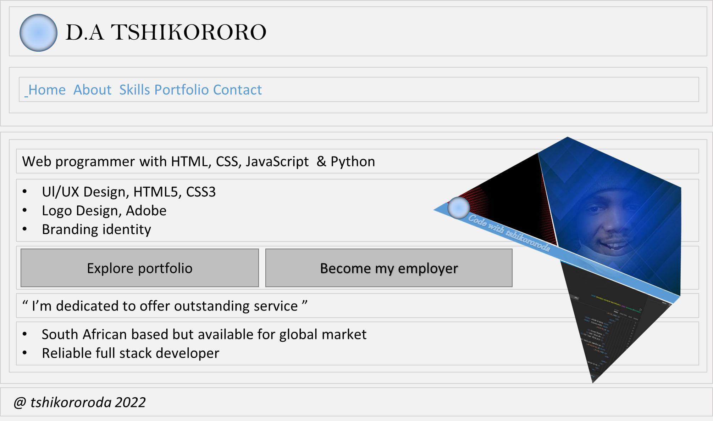
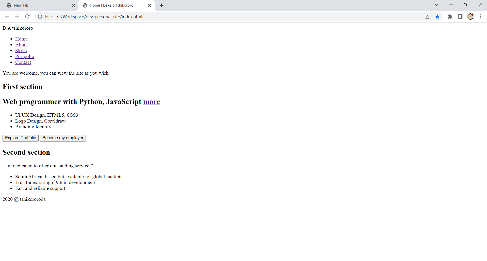

# Web Tutorial

| NO |              TABLE OF CONTENTS                     |
| ---| ---------------------------------------------------|
| 01 | [ Project requirements ](#project-requirements)    |
| 02 | [ Download and Install dev tools ](#dev-tools)     |
| 03 | [ Let’s start with our development ](#lets-start)  |
| 04 | [ GitHub - Control version ](#control-version)     |
| 05 | [ Repository ](#repository)                        |

<a name="project-requirements"></a>
### Project requirements
Alright, now it’s time to make your own _personal website_. Design a personal webpage about yourself. The project should be subject to the following Specification:
+ Your website must contain at least four different _`pages`_, and it should be possible to get from any page on your website to any other page by following one or more _`hyperlinks`_.
+ Your website must include at least one _`list (ordered or unordered)`_, at least one _`table`_, and at least one _`image`_.
+ You should also have some content placed within _`paragraph`_.
+ Your website must have at least one stylesheet file. The stylesheet(s) must use at least five different _`CSS properties`_, and at least five different types of _`CSS selectors`_. You must use the _`#id selector`_ at least once, and the _`.class selector`_ at least once.
+ •	All symbols should be implemented using `HTML entities`.

***

<a name="dev-tools"></a>
### Download and Install dev tools
+ Version control [GIT](https://git-scm.com/download/win)
+ Text editor&nbsp;&nbsp;&nbsp;&nbsp;&nbsp;&nbsp; : [Notepad++](https://notepad-plus-plus.org/downloads/) , [VS Code](https://code.visualstudio.com/) , [Atom](https://atom.io/)
+ Web browsers&nbsp;: [Chrome](https://www.google.com/chrome/) , [Firefox](https://www.mozilla.org/en-US/firefox/new/)

***

<a name="lets-start"></a>
### Let’s start with our development
Let's start by creating a _website directory on `c driver`_ for storing all our personal website files. This is where all our website projects will live. We will be working on _`Git Bash terminal`_ to create our _personal website directory_. Now, open your _Git bash terminal_, then click inside _terminal_ after it has open, and then _type_ the following command: _`cd c:/`_ followed by an _`Enter`_.

+ _`Change directory to move to c drive`._

      $ cd c:/

    _From here on out, to execute (i.e., run) a command means to type it into a git bash terminal and then hit Enter. Commands are “case-sensitive,” so be sure not to type in uppercase when you mean lowercase or vice versa._

+ _`Create a new directory called workspace on c drive`_. _Now, execute command below:_

      $ mkdir workspace

    _To move yourself into (i.e., open) that directory. Our prompt should now resemble the below. Now, execute command below:_

      $ cd workspace

+ _`Create a new directory called dev-personal-site`. Now, execute command below:_

      $ mkdir dev-personal-site

    _To move yourself into (i.e., open) that directory. Our prompt should now resemble the command below. Now, execute command below:_

      $ cd dev-personal-site

:clap: We have successfully created _root directory_ of our _personal website_. <br />
Below is the list of _command we have used_:

| Command | Description                  |
| ------- | ---------------------------- |
| _cd_    | _Change directory._          |
| _mkdir_ | _To create a new directory._ |

***

<a name="control-version"></a>
### GitHub - Control version
GitHub is a _code hosting platform for version control and collaboration_. It lets us and others work together on projects from anywhere. At first, we will look at GitHub essentials: _repositories, branches, commits, and pull requests_. Since we have already created our development environment directory called _dev-personal-site directory_, we’ll make it a _repository_ and learn GitHub's _pull request_ workflow which is a popular way to create and review code.

<a name="repository"></a>
### Repository
+ [ Create a file called `README.md`. ](#create-file)
+ [ Make _`dev-personal-site`_ directory a Git Repository ](#git-repository)
+ [ Project directory Structure ](#project-directory-structure)

<a name="create-file"></a>
#### Create a file called _`README.md`_.
We can create files from _git bash terminal_ in two ways. The first way is to use _**touch command**_ and the other way is to use _**echo command**_. If you want to write any specific data in the file, then use _**echo command**_. If you are not bothered about the data in the file but just want to create a file, then you can use _**touch command**_. <br />
_Now, execute the command below_:

```
$ echo "# Personal website root directory " > README.md
$ ls

```

Below is the list of command we have used:

| Command | Description                       |                 |
| ------- | ----------------------------------| --------------- |
| _ls_	  | To know what is on the directory  |                 |
| _cat_	  | To create a file with content	    | cat > filename  |
| _touch_ |	To create a file without content  | touch filename  |
| _fsutil_|	To create a file of specific size |                 |

<a name="git-repository"></a>
#### Make _`dev-personal-site`_ directory a Git Repository

````
$ git init

````

The _`git init command`_ will Initialize _dev-personal-site directory_ to an empty _Git repository in C:/workspace/dev-personal-site/.git/._

***

<a name="project-directory-structure"></a>
### Project directory Structure
+ [ Create the `sub-directory` folder ](#sub-directory)
+ [ List of modules ](#website-modules)
+ [ Create version file ](#create-version-file)
+ [ Creating a new branch ](#creating-a-new-branch)
+ [ Basic branching and merging ](#basic-branching-and-merging)
+ [ Switching branches ](#switching-branches)

#### Create the `sub-directory` folder
Now, let’s create the _subdirectory_ folder using _Git bash terminal_. For creating subfolder called _`assets`_. assets directory is a subdirectory of _`dev-personal-site`_ directory. Inside _assets_ directory we will create subdirectory of assets called _css, js and img_ as shown above. <br />
_Now, execute the command below_:

```
$ mkdir assets
$ cd assets
$ mkdir css js img
$ ls
$ cd ../

```
| Command    | Description                      |
| ---------- | ---------------------------------|
| _`cd ../`_ | to go to the previous directory. |
| _`mkdir`_  | to create directory folder.      |


<a name="website-modules"></a>
#### List of modules
Our personal website must contain at least four different _html_ pages. Our four different pages or models will be:

 Use _`touch command`_ to create html files:

| Modules	  | Html files                                   |
| --------- | ---------------------------------------------|
| Home	    | _index.html - This will be our landing page_ |
| About     | _about.html_                                 |
| Skills	  | _skills.html_                                |
| Portfolio | _portfolio.html_                             |   
| Contact   | _contact.html_                               |  

Now, execute the command below:

```
$ sudo touch index.html about.html skills.html portfolio.html contact.html

```

<a name="create-version-file"></a>
#### Create version file
To begin tracking a _file version_, we use _`git add command`_. A version of a version is created whenever _git commit command_ has been performed. <br />
This will be our first commit on the _`main branch`_. We will create other branches to work on and _`merge`_ them on _`main branch`_ whenever we are happy with the results. In this personal website’s projects, we will make branch for each _html_ files for the purpose of learning. <br />

Let's now begin tracking _index.html, about.html, skills.html, portfolio.html and contact.html_.

_Now, execute the command below_:
````
$ git add .
$ git commit -m " First commit: create an empty version of all html files "

````

<a name="creating-a-new-branch"></a>
#### Creating a _new_ branch
Now, before we do actual coding, let’s create a new branch for each html page. As we said earlier, the whole purpose of this is to learn. We have already said we will create branch for each page and merge them with _`main branch`_ whenever we are happy with the results. It’s a good practise to commit file and merge branches when we have meet project requirements at each stage. So, lets create a new branch called _`home, about, skill, home, portfolio, contact`_. _To do this, let’s execute the following command_:
```
$ git branch home
$ git branch about
$ git branch skill
$ git branch portfolio
$ git branch contact

```
<a name="basic-branching-and-merging"></a>
#### Basic on branching and merging
Now, you have switch to home branch. Let’s go through a simple example of branching and merging with a workflow that you might use in the real world based on our personal website project. Let’s follow these steps:

1. Do some work on a website main branch: = > _`‘You have done html5 document skeleton?’`_
2.	Create a branch for a new personal website you’re working on: => _`‘You have created home branch’`_
3.	Do some work in that new created branch: => _`‘This what we are going to do now’`_

<a name="switching-branches"></a>
#### Switching branches
To switch to homepage branch, you execute the following command:
```
$ git checkout home

```
***
### Home - Landing page
+ [ Add document Appropriate Skelton ](#das)
+ [ Sketching out our design ](#sketching)
+ [ Choosing our assets ](#choosing-your-assets)
+ [ Coding design layout ](#coding-landing-page)
+ [ Validate landing page ](#validate)
+ [ Rendered landing page ](#render-html-document)

<a name="das"></a>
#### Document Appropriate Skelton
First, we need to open our HTML editor _(Notepad++)_. When you open index.html, it will be clean white file which is to write your source code. If you are a new beginner on `HTML`, switch to [`test Yourself`](https://github.com/tshikororoda/html-css-js/) before you perform the actual coding with us.

In [HTML document structure](https://github.com/tshikororoda/html-css-js.git) repository, we can re-implement _hds_ source code, there's a folder called [_hds_](https://github.com/tshikororoda/html-css-js.git), there's html file named _`hds.index.html`_. Open the this html file, then copy and paste everything on your _`index.html`_ on your project and save the changes. Before we _commit_ this changes on our repository, we must `validate` our markup language. Professional web developers catch errors in their written `markup` by validating their document. To validate a document is to check our markup if it's abiding by all the rules according to the version of HTML we are using. Documents that are `error-free` are said to be valid HTML document. It is strongly recommended that we validate our markup documents, especially for professional sites. `Valid documents` are more consistent on a variety of browsers, they display more quickly, and they are more accessible. We use [ w3 Mark-up validation service](https://validator.w3.org/). For HTML5 documents, we use [Nu Html Checker](https://validator.nu/) validator.

 _Browser developer tools like the Firebug plug-in for Firefox or the built-in developer tools in Safari and Chrome also have validators so we an check our markup if is error-free._

 Let's now validate _`index.html`_ on our project, `fix all the bugs`, when document is `error-free`, we then create a new version of our file _`index.html`_ with the following massage, _`“I have added document structure (hds) for landing page”`_.

<a name="sketching"></a>
#### Sketching out our design
The first thing we will do is to _sketch out the layout_ of our websites landing page. We do have apps specialized for prototype design which professional developer uses to design full – scale layout of a websites. Grab pen and paper and sketch out roughly how you want your site to look. But for sketch below, is design using _Microsoft PowerPoint 2016_ after a rough sketch on paper.



<a name="choosing-your-assets"></a>
#### Choosing our `assets`
+ Content
+ [Theme color](https://developer.mozilla.org/en-US/docs/Web/CSS/CSS_Colors/Color_picker_tool)
+ Images
+ Font

<a name="coding-landing-page"></a>
#### Coding design layout
```html

<!--/@codewithtshikororoda
 Folder: dev-personal-site/index.html

-->

<!DOCTYPE html> <!-- HTML5 document version declaration -->
<html dir="ltr" lang="en">
  <head>

<!--____________________________________________
  [ Document header related tags here ]
-->

    <meta charset     ="utf-8" />
    <meta http-equiv  ="X-UA-Compatible"  content="IE=edge" />
    <meta name        ="viewport"         content="width=device-width, initial-scale=1.0" />
    <meta name        ="author"           content="Dakalo Tshikororo" />

    <title> Home | Dakalo Tshikororo </title>

  </head>
  <body>

<!--____________________________________________
  [ Document body related tags here ]
-->

<!-- Start of wrapper container -->

    <div id="tda-wrapper">

<!-- Start Header container -->

        <header id="tda-top-header">
            <div class="tda-row">
                <div class="tda-float-left">
                    <span> D.A tshikororo </span>
                </div>

                <div class="tda-float-right">
                    <nav>
                        <ul>
                            <li> <a href="#"> Home       </a> </li>
                            <li> <a href="#"> About      </a> </li>
                            <li> <a href="#"> Skills     </a> </li>
                            <li> <a href="#"> Portfolio  </a> </li>
                            <li> <a href="#"> Contact    </a> </li>
                        </ul>
                    </nav>
                </div>

                <p class="clear tda-float-right"> You are welcome, you can view the site as you wish </p>
            </div>

        </header>

<!-- End Header container -->

<!-- Start Main content container -->

        <main>
            <div class="tda-row">
                <section id="tda-section-one">
                  <h2 class="hidden"> First section </h2>

                    <h1> Web programmer with Python, JavaScript <span> <a href="">more</a></span></h1>

                    <ul>
                        <li> Ul/UX Design, HTML5, CSS3  </li>
                        <li> Logo Design, Coreldraw     </li>
                        <li> Branding Identity          </li>
                    </ul>

                    <div id="tda-button">
                        <button> Explore Portfolio  </button>
                        <button> Become my employer </button>
                    </div>

                </section>
            </div>

            <div class="tda-row">
                <section id="tda-section-two">
                  <h2 class="hidden"> Second section </h2>

                    <p> &#8220; Im dedicated to offer outstanding service &#8221; </p>

                    <ul>
                        <li> South African based but available for global markets  </li>
                        <li> TrustIndex ratingof 9.6 in development                </li>
                        <li> Fast and reliable support                             </li>
                    </ul>

                </section>
            </div>

        </main>

<!-- End Main content container -->

<!-- Start footer container -->

        <footer id="footer-wrapper">
            <div class="tda-row">
                <span> 2020 &#64; tshikororoda </span>
            </div>
        </footer>

<!-- End footer container -->

    </div>

<!-- End of wrapper container -->

  </body>
</html>

```
<a name="validate"></a>
#### Validate `landing page`
Here are some of the things validators ([ w3 Mark-up validation service](https://validator.w3.org/) / [Nu Html Checker](https://validator.nu/) ) check for:
+ The inclusion of a `DOCTYPE declaration`. Without declaration the validator doesn’t know which version of HTML or XHTML to validate against.
+ An indication of the character encoding for the document.
+ The inclusion of required rules and attributes.
+ Non-standard elements.
+ Mismatched tags.
+ Nesting errors.
+ Typos and other minor errors.

#### Rendered landing page
_Results on browsers_


## Split source code on index.html

Now, we need to split source code that we wrote earlier on _`(Index.html)`_. To achieve this, we simply create a new file called _`Home.html`_, then we cut the main content of _`Index.html`_ file and then paste the content on `Home.html`. Header and footer will remain on _`index.html`_ file as shown below. We want to avoid duplication of code mainly _`header and footer`_ since they appear in each module.

+ [Entry point  of all module: Index.html](#index)
+ [Module Home - Landing page](#home)

<a name="index"></a>
#### Entry point of all module : Index.html

This is the entry point of our website. We have now remove main content from _index.html_ and paste it on _home.html_ file. Within main element on _index.html_ we add _&lt;iframe&gt;_ element as shown below.

```html

<!--/@codewithtshikororoda
 Folder: dev-personal-site/Index.html

 @Entry point of all website module

-->

<!DOCTYPE html> <!-- HTML5 document version declaration -->
<html dir="ltr" lang="en">
  <head>

<!--____________________________________________
  [ Document header related tags here ]
-->

    <meta charset     ="utf-8" />
    <meta http-equiv  ="X-UA-Compatible"  content="IE=edge" />
    <meta name        ="viewport"         content="width=device-width, initial-scale=1.0" />
    <meta name        ="author"           content="Dakalo Tshikororo" />

    <title> Home | Dakalo Tshikororo </title>

  </head>
  <body>

<!--____________________________________________
  [ Document body related tags here ]
-->

<!-- Start of wrapper container -->

    <div id="tda-wrapper">

<!-- Start Header container -->

        <header id="tda-top-header">
            <div class="tda-row">
                <div class="tda-float-left">
                    <span> tshikororoda </span>
                </div>

                <div class="tda-float-right">
                    <nav>
                        <ul>
                            <li> <a href="#" onclick="loadPageContent('Home');">      Home       </a> </li>
                            <li> <a href="#" onclick="loadPageContent('About');">     About      </a> </li>
                            <li> <a href="#" onclick="loadPageContent('Skills');">    Skills     </a> </li>
                            <li> <a href="#" onclick="loadPageContent('Portfolio');"> Portfolio  </a> </li>
                            <li> <a href="#" onclick="loadPageContent('Contact');">   Contact    </a> </li>
                        </ul>
                    </nav>
                </div>

                <p class="clear tda-float-right"> You are welcome, you can view the site as you wish </p>
            </div>

        </header>

<!-- End Header container -->

<!-- Start Main content container -->

        <main>
          <iframe></iframe>
        </main>

<!-- End Main content container -->

<!-- Start footer container -->

        <footer id="footer-wrapper">
            <div class="tda-row">
                <span> 2020 &#64; tshikororoda </span>
            </div>

        </footer>

<!-- End footer container -->

    </div>

<!-- End of wrapper container -->

    <!-- External JavaScript -->
    <script src="./assets/js/main.js"></script>
  </body>
</html>

```

<a name="home"></a>
#### Module Home - Landing page

+ [Create a file called Home.html](#)
+ [Home content](#)

###### Create a file called: Home.html

```

$ sudo touch Home.html

```
###### Home content

```html

<!--/@codewithtshikororoda
 Folder: dev-personal-site/Home.html

 @Landing page
 @Set as a default

-->

<div class="tda-row">
	<section id="tda-section-one">
	  <h2 class="hidden"> First section </h2>

		<h1> Web programmer with Python, JavaScript <span> <a href="">more</a></span></h1>

		<ul>
			<li> Ul/UX Design, HTML5, CSS3  </li>
			<li> Logo Design, Coreldraw     </li>
			<li> Branding Identity          </li>
		</ul>

		<div id="tda-button">
			<button> Explore Portfolio  </button>
			<button> Become my employer </button>
		</div>

	</section>
</div>

<div class="tda-row">
	<section id="tda-section-two">
	  <h2 class="hidden"> Second section </h2>

		<p> &#8220; Im dedicated to offer outstanding service &#8221; </p>

		<ul>
			<li> South African based but available for global markets  </li>
			<li> Trust Index rating of 9.6 in development              </li>
			<li> Fast and reliable support                             </li>
		</ul>

	</section>
</div>

```

#### Load module content to _Index file iframe_
Now, we are going to create a <span style="color: yellow;">JavaScript function</span> to handle two things:
+ Title of the active module.
+ Load module to iframe.  

We want our <span style="color: yellow;">_title to dynamically changes_</span> to an active module. When the user access our landing page (Home.html), The _`title`_ of the page should be `" Home | Dakalo Tshikororo "`. Whenever a user navigate to another page such as about, the title of the page should be change to `" About | Dakalo Tshikororo "` etc.

When a user click on the link of one of the following module `Home.html, About.html, Skills.html, Portfolio, and Contact.html` the module file must load dynamically to an `Index.html` file on iframe element using <span style="color: yellow;">JavaScript</span> by assigning new value of `src attribute`. This is how a requested module will load it's content on the web browser. `Home.html` will be set as a default whenever HTML document is loaded on the web browser.

+ [Pseudo code](#pseudo)
+ [Create a file named Main.js](#createmainjs)
+ [Main.js code](#mainjs)

<a name="pseudo"></a>
##### Pseudo code

```
Define variable called moduleName.
Set/initialize the value of moduleName to undefined.
Define a function called loadPageContent with parameter variable called value
	 loadPageContent(value)

Define three variables named:
	iframe, current_page and loaded_page.

Select iframe element from DOM (index.html) using querySelector methods passing a tag name as an argument.
Set/initialize the value of currentPage to the parameter variable named value to get an argument.

if the currentPage is set to undefined value
	set document title to "Home | Dakalo Tshikororo".
	set currentPage to "Home".
	set loadedPage to "./" + currentPage + ".html".
	set iframe attribute src to loadedPage.

else currentPage is set to a defined value
	set document title 	to value + " | Dakalo Tshikororo".
  set loadedPage to "./" + currentPage + ".html".
	set iframe attribute src to loadedPage.

```

<a name="createmainjs"></a>
##### Create a file named Main.js
```
$ sudo touch main.js

```

<a name="mainjs"></a>
##### Main.js code

```js
"use strict";

// Define the parameter variable called moduleName.
let moduleName;

// Set/initialize moduleName to undefined.
moduleName = undefined;

// Define a function called loadPageContent with parameter variable called value
function loadPageContent(value) {

  // Define variables
  let iframe;
  let currentPage;
  let loadedPage;

  // Select iframe element from DOM passing a tag name as an argument.
  iframe = document.querySelector("iframe");

  // Set/initialize currentPage to argument.
  currentPage = value;

  if(currentPage == undefined){

    /*  
        If the currentPage is set to undefined value.
        This is loaded as a default.
                                      */
      document.title  = "Home | Dakalo Tshikororo ";
      currentPage     = "Home";
      loadedPage      = "./" + currentPage + ".html";

      iframe.setAttribute("src", loadedPage);

	}else{ // if currentPage is set to a defined value

      document.title = value + " | Dakalo Tshikororo ";
      loadedPage     = "./" + currentPage + ".html";

      iframe.setAttribute("src", loadedPage);

	} // End of conditional statements

}// End of function: loadPageContent(title);

// Run this functions when the document is loaded
window.onload = function()	{ // #01

	loadPageContent(moduleName);

}

```
